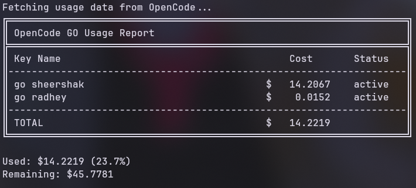

# OpenCode Go Usage Tracker

A minimalistic, standalone bash script to track your OpenCode Go subscription usage per API key. Easily see how much of your $60/month inference allowance has been used, and who used it.



## Prerequisites

Make sure you have the following command-line tools installed on your system:
- `bash` (Unix shell)
- `curl` (for fetching usage data from the OpenCode API)
- `jq` (for reading local JSON configuration files)
- `node` (for safely parsing OpenCode's custom Javascript payload streams)

## Quick Start

1. **Clone the repository:**
   ```bash
   git clone https://github.com/YOUR_USERNAME/opencode-go-usage.git
   cd opencode-go-usage
   chmod +x go-usage.sh
   ```

2. **Login and Setup:**
   Run the login command:
   ```bash
   ./go-usage.sh login
   ```
   Follow the on-screen prompts to manually paste your `auth` cookie and workspace ID from your browser's Developer Tools.

3. **View your Report:**
   Once configured, you can simply run:
   ```bash
   ./go-usage.sh report
   ```

## License
MIT
